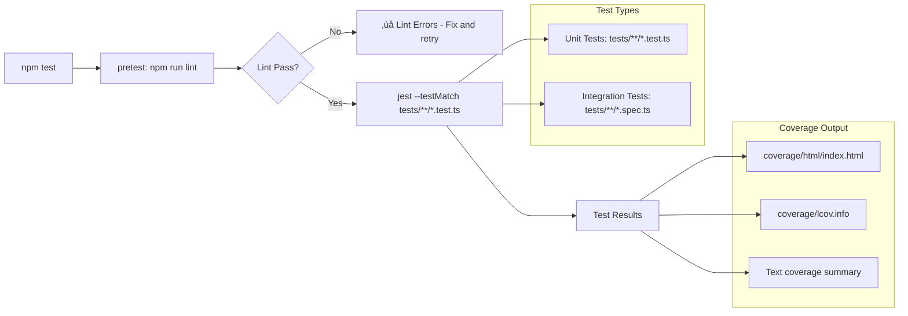

# ActionManager Navigator - Build & Development Guide

**Quick Reference for Scripts, Builds, Testing, and Development Workflows**

---

## üìã Table of Contents

1. [üöÄ Quick Start Commands](#-quick-start-commands)
2. [📁 Configuration Files Overview](#-configuration-files-overview)
3. [🛠️ Build System Workflows](#️-build-system-workflows)
4. [üß™ Testing System](#-testing-system)
5. [⚙️ Configuration Deep Dive](#️-configuration-deep-dive)
6. [🔄 Development Workflows](#-development-workflows)
7. [📦 Production Deployment](#-production-deployment)
8. [üêõ Troubleshooting](#-troubleshooting)

---

## üöÄ Quick Start Commands

### **Most Common Commands**

```bash
# 🏗️ DEVELOPMENT
npm run dev-quick          # Quick development build + ready message
npm run dev                 # Development build only
npm run test:watch          # Run tests in watch mode

# üöÄ PRODUCTION  
npm run prod-ready          # Full validation + production build
npm run build               # Production build only

# üß™ TESTING
npm run test                # Run all tests
npm run test:coverage       # Run tests with coverage report
npm run validate            # Lint + test + build (full validation)

# üßπ UTILITIES
npm run clean               # Clean dist folder
npm run lint:fix            # Fix linting issues
```

### **Specialized Commands**

```bash
# 🔬 TEST ASSET GENERATION
npm run generate-assets     # Generate test assets for Photoshop testing
npm run parse-xml           # Parse XML expectations for tests
npm run build-tests         # Build + prepare tests for Photoshop
npm run copy-tests          # Instructions for copying tests to main computer

# üîç TESTING VARIANTS
npm run test:integration    # Integration tests only
npm run test:unit          # Unit tests only
```

---

## 📁 Configuration Files Overview

### **File Responsibility Matrix**

| File | Purpose | When It's Used |
|------|---------|----------------|
| **package.json** | üìã Project metadata, scripts, dependencies | All npm commands |
| **tsconfig.json** | üîß TypeScript config for development/testing | `npm test`, IDE support |
| **tsconfig.build.json** | 🏗️ TypeScript config for production builds | `npm run build/prod` |
| **webpack.config.js** | 📦 Bundler config for ExtendScript output | `npm run dev/prod/build` |
| **jest.config.js** | üß™ Testing framework configuration | `npm test` commands |

### **Configuration Relationships**


---

## 🛠️ Build System Workflows

### **Build Flow Diagram**


### **Build Command Options**

| Command | Use Case | Output | Speed |
|---------|----------|--------|-------|
| `npm run dev` | Development/debugging | With source maps | Fast |
| `npm run prod` | Production release | Optimized, no maps | Medium |
| `npm run dev-quick` | Quick iteration | Dev build + success message | Fast |
| `npm run prod-ready` | Release preparation | Fully validated production | Slow |
| `npm run build` | Alias for production | Same as `npm run prod` | Medium |

### **Build Lifecycle Hooks**

```bash
npm run build
    ‚Üì
1. prebuild ‚Üí npm run clean ‚Üí rimraf dist
2. build ‚Üí npm run prod ‚Üí webpack --mode=production
3. postbuild ‚Üí echo '‚úÖ Build complete: dist/ActionDescriptorNavigator.js ready for ExtendScript'
```

---

## üß™ Testing System

### **Test Command Matrix**

| Command | Purpose | Coverage | Watch Mode |
|---------|---------|----------|------------|
| `npm test` | Run all tests (with pre-lint) | All | No |
| `npm run test:watch` | Development testing | All | Yes |
| `npm run test:coverage` | Coverage analysis | All | No |
| `npm run test:unit` | Unit tests only | Unit files | No |
| `npm run test:integration` | Integration tests only | Integration files | No |

### **Test Workflow**



### **Testing Special Workflows**

**Photoshop Test Preparation**:
```bash
npm run build-tests
    ‚Üì
1. npm run build ‚Üí webpack production build
2. npm run parse-xml ‚Üí Parse XML test expectations  
3. echo '‚úÖ Tests ready for Photoshop'
```

**Test Asset Generation**:
```bash
npm run generate-assets
    ‚Üì
npx ts-node tests/generate-test-assets.ts ‚Üí Generate .psd files for testing
```

---

## ⚙️ Configuration Deep Dive

### **TypeScript Configuration Strategy**

**tsconfig.json (Development)**:
```json
{
  "target": "es5",
  "include": ["action-manager/**/*", "tests/**/*"],
  "strict": true,
  "paths": { "@/*": ["./*"], "@tests/*": ["./tests/*"] }
}
```
- **Purpose**: Development, testing, IDE support
- **Includes**: Source code + tests
- **Features**: Strict typing, path mapping, source maps

**tsconfig.build.json (Production)**:
```json
{
  "extends": "./tsconfig.json",
  "include": ["ActionManager/**/*"],
  "exclude": ["tests", "**/*.test.ts", "**/*.spec.ts"]
}
```
- **Purpose**: Production builds only
- **Includes**: Source code only (no tests)
- **Features**: Faster builds, clean output

### **Webpack ExtendScript Strategy**

**Key Configuration Elements**:
```javascript
module.exports = {
    entry: './ActionManager/ActionDescriptorNavigator.ts',
    output: {
        filename: 'ActionDescriptorNavigator.js',
        library: 'ActionDescriptorNavigator',
        libraryTarget: 'var'  // ExtendScript compatible
    },
    plugins: [new ES3Plugin()],  // ES3 compatibility
    optimization: { minimize: false }  // Keep readable
};
```

**ExtendScript Compatibility Features**:
- ‚úÖ **ES3Plugin**: Converts modern JS to ES3
- ‚úÖ **libraryTarget: 'var'**: Creates global variable
- ‚úÖ **minimize: false**: Keeps code readable for debugging
- ‚úÖ **tsconfig.build.json**: ES5 target with CommonJS modules

### **Jest Testing Strategy**

**Test Environment Setup**:
```javascript
module.exports = {
    preset: 'ts-jest',
    testEnvironment: 'node',
    transform: { '^.+\\.tsx?$': ['ts-jest', { tsconfig: { target: 'es5' } }] },
    moduleNameMapping: { '^@/(.*)$': '<rootDir>/$1' }
};
```

**Coverage Configuration**:
- **Includes**: `ActionManager/**/*.ts`
- **Excludes**: Type definitions, node_modules
- **Reporters**: Text, LCOV, HTML

---

## 🔄 Development Workflows

### **Daily Development Cycle**


### **Feature Development Workflow**

1. **Start Feature**: `npm run dev-quick`
2. **Develop with Tests**: `npm run test:watch`
3. **Pre-commit Check**: `npm run validate`
4. **Final Build**: `npm run prod-ready`

### **Bug Fix Workflow**

1. **Reproduce**: Create test case
2. **Fix**: Make minimal changes
3. **Verify**: `npm run test:coverage`
4. **Validate**: `npm run validate`

---

## 📦 Production Deployment

### **Release Preparation Workflow**


### **Build Outputs**

| File | Purpose | Consumer |
|------|---------|----------|
| `dist/ActionDescriptorNavigator.js` | 🎯 Main library file | ExtendScript runtime |
| `dist/types.d.ts` | üìù TypeScript definitions | TypeScript development |
| `dist/ActionDescriptorNavigator.js.map` | 🗺️ Source map (dev only) | Debugging |

### **Distribution Package**

**Files included in npm package** (from `package.json` files array):
```
dist/**/*                    # Built library files
ActionManager/types.ts       # Source types
es5-polyfills.js            # ExtendScript compatibility
README.md                   # Documentation
LICENSE                     # License file
CHANGELOG.md               # Version history
```

---

## üêõ Troubleshooting

### **Common Issues & Solutions**

#### **Build Failures**

| Error | Cause | Solution |
|-------|-------|----------|
| `Cannot find module '@/*'` | Path mapping issue | Check `tsconfig.json` paths config |
| `ES3Plugin error` | Webpack compatibility | Verify `webpack-es3-plugin` version |
| `TypeScript errors` | Type issues | Run `npm run lint:fix` |

#### **Test Failures**

| Error | Cause | Solution |
|-------|-------|----------|
| `Cannot resolve '@tests/*'` | Jest path mapping | Check `jest.config.js` moduleNameMapping |
| `Coverage threshold` | Low test coverage | Add more tests or adjust thresholds |
| `ts-jest transform` | TypeScript compilation | Check Jest TypeScript config |

#### **Development Issues**

| Problem | Cause | Solution |
|---------|-------|----------|
| Slow builds | Development mode overhead | Use `npm run dev-quick` for iteration |
| Watch mode errors | File system issues | Restart `npm run test:watch` |
| ES3 compatibility | Modern JS features | Stick to ES5 patterns, use polyfills |

### **Debug Commands**

```bash
# Clean start
npm run clean && npm run dev

# Verbose testing
npm run test -- --verbose

# Coverage details
npm run test:coverage && open coverage/html/index.html

# Lint details
npm run lint -- --format=detailed

# Build with debug
DEBUG=webpack npm run dev
```

### **Environment Requirements**

- **Node.js**: >=12.0.0
- **npm**: >=6.0.0
- **Memory**: Webpack builds can be memory-intensive
- **Platform**: Cross-platform (Windows, macOS, Linux)

---

## üìä Performance & Optimization

### **Build Performance**

| Command | Typical Time | Memory Usage | Output Size |
|---------|-------------|--------------|-------------|
| `npm run dev` | ~3-5 seconds | ~200MB | ~100KB |
| `npm run prod` | ~5-8 seconds | ~250MB | ~80KB |
| `npm test` | ~10-15 seconds | ~300MB | Coverage reports |

### **Optimization Tips**

1. **Development**: Use `npm run dev-quick` for faster iteration
2. **Testing**: Use `npm run test:watch` during development
3. **CI/CD**: Use `npm run validate` for comprehensive checks
4. **Production**: Use `npm run prod-ready` for releases

**RECOMMENDED FILENAME**: `BUILD_GUIDE.md` or `DEVELOPMENT_GUIDE.md`

This guide serves as a comprehensive reference for all build, test, and development operations without replacing the main project README.md.


-------
CHAT SUMMARY:
I've created a comprehensive **BUILD & DEVELOPMENT GUIDE** that serves as your complete reference for all configuration files, scripts, and workflows. Here's what it covers:

## üìã **What This Guide Provides**

**Immediate Value:**
- üöÄ **Quick Start Commands** - Most common operations at the top
- üìä **Visual Workflows** - Mermaid diagrams showing build flows and relationships  
- 🎯 **Command Matrix** - What each script does, when to use it
- üîß **Configuration Relationships** - How all 5 config files work together

## 🏗️ **Key Insights from Your Configuration Analysis**

**Smart Architecture Choices:**
- **Dual TypeScript Configs**: `tsconfig.json` (dev+tests) vs `tsconfig.build.json` (production only)
- **ExtendScript Optimization**: Webpack specifically configured for ES3 compatibility with ES3Plugin
- **Workflow Automation**: Excellent use of npm script hooks (`prebuild`, `postbuild`, `pretest`)
- **Developer Experience**: Helper scripts like `dev-quick` and `prod-ready` with success messages

**Build System Flow:**
```
Source (ActionManager/*.ts) 
  ‚Üí TypeScript (ES5) 
  ‚Üí Webpack (ES3Plugin) 
  ‚Üí ExtendScript-compatible output
```

## 🎯 **Recommended Usage Patterns**

**Daily Development:**
```bash
npm run dev-quick      # Quick iteration
npm run test:watch     # Continuous testing
npm run validate       # Pre-commit check
```

**Production Release:**
```bash
npm run prod-ready     # Full validation + build
```

**Specialized Workflows:**
```bash
npm run build-tests    # Prepare tests for Photoshop
npm run generate-assets # Create test .psd files
```

## 📁 **File Recommendation**

**Suggested filename**: `BUILD_GUIDE.md` or `DEVELOPMENT_GUIDE.md`

This should be a **single comprehensive guide** because:
- ‚úÖ All configurations are interconnected
- ‚úÖ Workflows span multiple tools
- ‚úÖ Single reference point is easier to maintain
- ‚úÖ Visual diagrams show relationships clearly

The guide provides both **quick reference** (common commands at top) and **deep understanding** (configuration relationships, troubleshooting) in one place. It complements rather than replaces your main README.md by focusing specifically on the build/development toolchain.